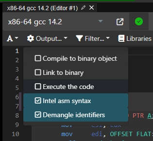
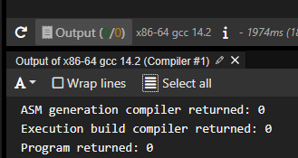

## 基本程序概念

- 红 P3-9 / OCR P23
- 蓝 P28-41

::: tip 读完本小结，你应该能够
:::

- 感性了解C++程序的基本结构
- 了解 [`预处理指令`](https://zh.cppreference.com/w/cpp/preprocessor)
  - 初识 `#include <>` 与 `#include ""`
  - 初识 `#define`
- 了解 [`注释`](https://zh.cppreference.com/w/cpp/comment) 的作用
- 了解 [`main函数`](https://zh.cppreference.com/w/cpp/language/main_function) 的作用
- 初识 [`命名空间`](https://zh.cppreference.com/w/cpp/language/namespace)
- 初识 [`输入输出流`](https://zh.cppreference.com/w/cpp/io) 也就是 
  - `#include <iostream>` 中的 [`iostream`](https://zh.cppreference.com/w/cpp/header/iostream) 头文件
  - `std::cout`
  - `std::cin`
  - `<<` 和 `>>`，实际上是运算符

  > 更推荐参考：1.1.1 5.输入输出流 C++20高级编程（第五版）P6 / OCR P26
- 了解 [`控制流`](https://zh.cppreference.com/w/cpp/language/statements)

::: tip 结合两本书，你还能了解到
:::

- 字符串里别扭的 [`转义字符`](https://zh.cppreference.com/w/cpp/language/escape) 如 `\n` `\t` 等
- 认识基础[`运算符`]，如 `+` `-` `*` `/` `%` `=` `==` `!=` `>` `<` `>=` `<=`
- 一些奇怪的名词，比如
  - [`函数`](https://zh.cppreference.com/w/cpp/language/functions)
  - [`字面量`](https://zh.cppreference.com/w/cpp/language/expressions#.E5.AD.97.E9.9D.A2.E9.87.8F)
  - [`初始化`]

::: tip 以下内容会在后一节详细讲解
:::

- `变量`, 准确来说是 [`标识符`]
- [`基本类型`]，后面还会学到 [`类`]
- [`类型`]，实际上还会有另外一个名词 [`值类别`]，这俩特别容易搞混
- [`声明`](https://zh.cppreference.com/w/cpp/language/declarations) - `标识符声明` 又名 `简单声明`

## 一系列帮助建立直观认识的例子

**hello world**
```cpp
#include <iostream>
int main() {
    std::cout << "Hello, World!\n";
}
```

**一个简单的加法**
```cpp
#include <iostream>
int main() {
    int a = 1;
    int b = 2;
    int c = a + b;
    std::cout << c << '\n';
    std::cout << a + b << '\n';
}
```

**一个简单的判断**
```cpp
#include <iostream>
int main() {
    int a = 1;
    int b = 2;
    if (a > b) {
        std::cout << "a > b\n";
    } else {
        std::cout << "a <= b\n";
    }
}
```

**一个简单的循环**
```cpp
#include <iostream>
int main() {
    for (int i = 0; i < 10; ++i) {
        std::cout << i << '\n';
    }
}
```

**一个简单的函数**
```cpp
#include <iostream>
int add(int a, int b) {
    return a + b;
}
int main() {
    int a = 1;
    int b = 2;
    int c = add(a, b);
    std::cout << c << '\n';
}
```

**一个简单的命名空间**
```cpp
#include <iostream>
namespace A {
    int a = 1;
}
namespace B {
    int a = 2;
}
int main() {
    std::cout << A::a << '\n';
    std::cout << B::a << '\n';
}
```

## 使用 Compiler Explorer

- https://godbolt.org/
- https://compiler-explorer.com/

::: tip
Compiler Explorer 是一个在线的编译器，可以帮助你快速查看代码的编译结果。

不过我目前没有精力一个一个敲出来生成短链给你们来尝试，你们可以自己打开，然后把上面的代码粘贴进去，
看看编译结果，以及有空的话，生成短链，粘贴到文章中，方便大家查看。
:::

::: warning
如果粘贴后只有汇编结果没有输出结果，可以如图勾上 Execute the code 并点击/拖拽下方 Output：
:::





[`基本类型`]: https://zh.cppreference.com/w/cpp/language/types
[`类型`]: https://zh.cppreference.com/w/cpp/language/type
[`值类别`]: https://zh.cppreference.com/w/cpp/language/value_category
[`运算符`]: https://zh.cppreference.com/w/cpp/language/operators
[`表达式`]: https://zh.cppreference.com/w/cpp/language/expressions
[`初始化`]: https://zh.cppreference.com/w/cpp/language/initialization
[`类`]: https://zh.cppreference.com/w/cpp/language/classes
[`标识符`]: https://zh.cppreference.com/w/cpp/language/identifiers
[`对象`]: https://zh.cppreference.com/w/cpp/language/object

<DiscourseComments />
